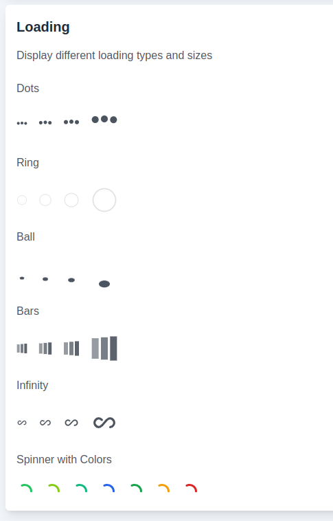

# Componente Loading

### Introdução

O componente `Loading` é utilizado para exibir diferentes tipos de indicadores de carregamento com diversos tamanhos e cores.

### Imagem de Referência



### Como Utilizar

```jsx

<Loading className="loading-dots" size="md" color="primary" />

### Propriedades

O componente `Loading` aceita as seguintes propriedades:

|propriedade|descrição|tipo|valor padrão|
|---|---|---|---|
|`className`|Define classes de estilização. |string|-|
|`color`|Define a cor do componente.|string|-|
|`size`|Define o tamanho do componente.|string|-|
